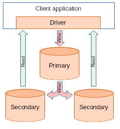
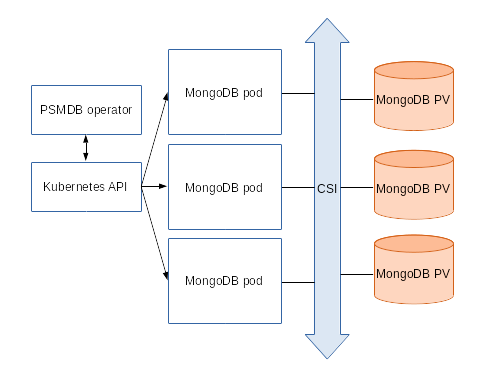

Design overview
================

The design of the operator is highly bound to the Percona server for MongoDB replication process, which in its turn can be briefly described with the following diagram.

{: .align-center}

There is always one primary server and several secondary ones (two on the picture), and client application accesses them via driver implemented as a library. 

To provide high availability operator uses [node affinity](https://kubernetes.io/docs/concepts/configuration/assign-pod-node/#affinity-and-anti-affinity) to run MongoDB instances on separate worker nodes if possible, and database cluster is deployed as a single Replica Set with at least 3 nodes. If some node fails, the pod with the mongod process inside of it is automatically re-created on another node. If the failed node was hosting the primary PSMDB, replica set initiates elections to select a new primary (in case if failed node was running the operator, Kubernetes will restart it on some other node, so normal operation will not be interrupted).

Client applications should use a mongo+srv URI for the connection: in this case, mongo driver detects which node is primary, so it will send write requests to it and read from secondary nodes, as intended by the MongoDB replication design, and so MongoDB will be able to control data integrity on all nodes.

**Note:** *We use enforced security in contrast to default MongoDB setup. The initial configuration contains default passwords for all needed user accounts, which should be changed in the production environment, as it is stated in the [installation instructions](./psmdb-operator.install.md).*

{: .align-center}

To provide data storage for the stateful applications, Kubernetes uses Persistent Volumes. A *PersistentVolumeClaim* (PVC) is used to implement the automatic storage provisioning to pods.  If a failure occurs, the Container Storage Interface (CSI) should be able to re-mount storage on a different node. So in our case PVC StorageClass should support this feature (Kubernetes and OpenShift support this in versions 1.9 and 3.9 respectively).

The operator functionality extends Kubernetes API with *PerconaServerMongoDB* object, and is implemented as a golang application. Each *PerconaServerMongoDB* object maps to one separate PSMDB setup. The operator listens to all events on the created objects. When a new PerconaServerMongoDB object is created, or an existing one undergoes some changes or deletion, the operator automatically creates/changes/deletes all needed Kubernetes objects with the appropriate settings to provide proper PSMDB operating.
