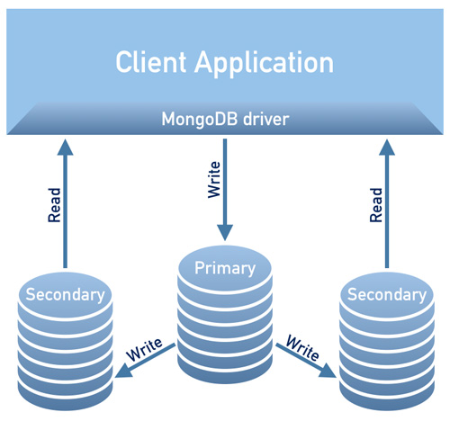

Design overview
===============

The design of the Operator is tighly bound to the Percona Server for
MongoDB replica set, which is briefly described in the following
diagram.

A replica set consists of one primary server and several secondary ones
(two in the picture), and the client application accesses the servers
via a driver.

To provide high availability the Operator uses `node
affinity <https://kubernetes.io/docs/concepts/configuration/assign-pod-node/#affinity-and-anti-affinity>`__
to run MongoDB instances on separate worker nodes if possible, and the
database cluster is deployed as a single Replica Set with at least three
nodes. If a node fails, the pod with the mongod process is automatically
re-created on another node. If the failed node was hosting the primary
server, the replica set initiates elections to select a new primary. If
the failed node was running the Operator, Kubernetes will restart the Operator on
another node, so normal operation will not be interrupted.

Client applications should use a mongo+srv URI for the connection. This
allows the drivers (4.0 and up) to retrieve the list of replica set
members from DNS SRV entries without having to list hostnames for the
dynamically assigned nodes.

.. note::

   The Operator uses security settings which are more secure
   than the default Percona Server for MongoDB setup. The initial
   configuration contains default passwords for all needed user accounts,
   which should be changed in the production environment, as stated in
   the  `installation instructions <openshift.html>`_.

.. image:: operator.png
   :width: 250px
   :align: center
   :height: 250px
   :alt: Percona Server for MongoDB Operator

To provide data storage for stateful applications, Kubernetes uses
Persistent Volumes. A *PersistentVolumeClaim* (PVC) is used to implement
the automatic storage provisioning to pods. If a failure occurs, the
Container Storage Interface (CSI) should be able to re-mount storage on
a different node. The PVC StorageClass must support this feature
(Kubernetes and OpenShift support this in versions 1.9 and 3.9
respectively).

The Operator functionality extends the Kubernetes API with
*PerconaServerMongoDB* object, and it is implemented as a golang
application. Each *PerconaServerMongoDB* object maps to one separate
Percona Server for MongoDB setup. The Operator listens to all events on the
created objects. When a new PerconaServerMongoDB object is created, or an
existing one undergoes some changes or deletion, the operator automatically
creates/changes/deletes all needed Kubernetes objects with the
appropriate settings to provide a properly operating replica set.

