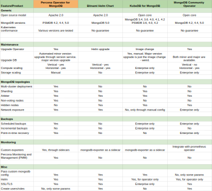

.. _compare:

Compare various solutions to deploy MongoDB in Kubernetes
=========================================================

There are multiple ways to deploy and manage MongoDB in Kubernetes. This article focuses on comparing the following open source solutions:

* `Bitnami Helm chart <https://github.com/bitnami/charts/tree/master/bitnami/mongodb>`_
* `KubeDB <https://github.com/kubedb>`_
* `MongoDB Community Operator <https://github.com/mongodb/mongodb-kubernetes-operator>`_
* `Percona Operator for MongoDB <https://github.com/percona/percona-server-mongodb-operator/>`_

