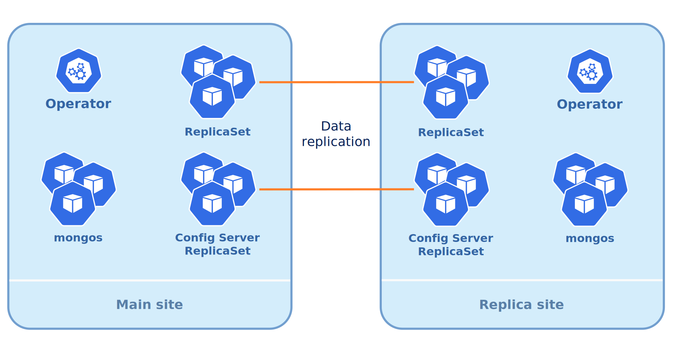
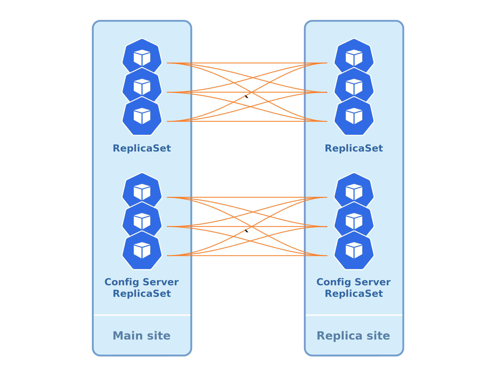

.. _operator-replication:

Set up Percona Server for MongoDB cross-site replication
========================================================

The cross-site replication involves configuring one MongoDB site as *Main*, and another MongoDB site as *Replica* to allow replication between them:

The Operator automates configuration of *Main* and *Replica* MongoDB sites, but the feature itself is not bound to Kubernetes. Either *Main* or *Replica* can run outside of Kubernetes, be regular MongoDB and be out of the Operators’ control.

This feature can be useful in several cases: 
- simplify the migration of the MongoDB cluster to and from Kubernetes
- add remote nodes to the replica set for disaster recovery 

.. note:: Cross-site replication has technical preview status and is not
   recommended for production environments.

Configuring the cross-site replication for the cluster controlled by the Operator is explained in the following subsections.

.. contents:: :local:

.. _operator-replication-expose:

Exposing instances of the MongoDB cluster
--------------------------------------------

You need to expose all Replica Set nodes (including Config
Servers) through a dedicated service to ensure that *Main* and *Replica*
can reach each other, like in a full mesh:

This is done through the
``replsets.expose``, ``sharding.configsvrReplSet.expose``, and
``sharding.mongos.expose`` sections in the ``deploy/cr.yaml`` configuration file
as follows.

.. code:: yaml

   spec:
     replsets:
     - rs0:
       expose:
         enabled: true
         exposeType: LoadBalancer
       ...
     sharding:
       configsvrReplSet:
         expose:
           enabled: true
           exposeType: LoadBalancer
         ...

The above example is using the LoadBalancer Kubernetes Service object, but there
are other options (ClusterIP, NodePort, etc.).

.. note:: The above example will create a LoadBalancer per each Replica Set Pod.
   In most cases, this Load Balancer should be internet-facing for cross-region
   replication to work.
   
To list the endpoints assigned to Pods, list the Kubernetes Service objects by 
executing ``kubectl get services -l "app.kubernetes.io/instance=CLUSTER_NAME"`` command.

.. _operator-replication-source:

Configuring cross-site replication on Main site
------------------------------------------------------

The cluster managed by the Operator should be able to reach external nodes of the
Replica Sets. You can provide needed information in the
``replsets.externalNodes`` and ``sharding.configsvrReplset.externalNodes``
subsections of the ``deploy/cr.yaml`` configuration file. Following keys can
be set to specify each external *Replica*, both for its Replica Set and Config Server
instances:

* set ``host`` to URL or IP address of the external replset instance,
* set ``port`` to the port number of the external node (or rely on the ``27017``
  default value),

Optionaly you can set the following additional keys:

* ``priority`` key sets the `priority <https://docs.mongodb.com/manual/reference/replica-configuration/#mongodb-rsconf-rsconf.members-n-.priority>`_
  of the external node (``2`` by default for all local members of the cluster;
  external nodes should have lower priority to avoid unmanaged node being elected
  as a primary; ``0`` adds the node as a :ref:`non-voting member<arbiter-nonvoting>`),
* ``votes`` key sets the number of `votes <https://docs.mongodb.com/manual/reference/replica-configuration/#mongodb-rsconf-rsconf.members-n-.votes>`_
  an external node can cast in a replica set election (``0`` by default, and
  ``0`` for non-voting members of the cluster). 

Here is an example:

.. code:: yaml

   spec:
     unmanaged: false
     replsets:
     - name: rs0
       externalNodes:
       - host: rs0-1.percona.com
         port: 27017
         priority: 0
         votes: 0   
       - host: rs0-2.percona.com
       ...
     sharding:
       configsvrReplSet:
         size: 3
         externalNodes:
           - host: cfg-1.percona.com
             port: 27017
             priority: 0
             votes: 0   
           - host: cfg-2.percona.com
           ...

The *Main* site will be ready for replication when you apply changes as usual:

.. code:: bash

   $ kubectl apply -f deploy/cr.yaml

.. _operator-replication-source-secrets:

Getting the cluster secrets and certificates to be copied from Main to Replica
******************************************************************************

*Main* and *Replica* should have same Secrets objects (to have same
users credentials) and certificates. So you may need to copy them from *Main*.
Names of the corresponding objects are set in the ``users``, ``ssl``, and
``sslInternal`` keys of the Custom Resource ``secrets`` subsection
(``my-cluster-name-secrets``, ``my-cluster-name-ssl``, and
``my-cluster-name-ssl-internal`` by default).

If you can get Secrets from an existing cluster by executing the
``kubectl get secret`` command for *each* Secrets object you want to acquire:

.. code:: bash

   $ kubectl get secret my-cluster-name-secrets -o yaml > my-cluster-secrets.yaml

Next remove the ``annotations``, ``creationTimestamp``, ``resourceVersion``,
``selfLink``, and ``uid`` metadata fields from the resulting file to make it
ready for the *Replica*.

You will need to :ref:`further apply these secrets on Replica<operator-replication-replica-secrets>`.

.. _operator-replication-replica:

Configuring cross-site replication on Replica instances
-------------------------------------------------------

When the Operator creates a new cluster, a lot of things are happening, such as
electing the Primary, generating certificates, and picking specific names. This
should not happen if we want the Operator to run the *Replica* site, so first
of all the cluster should be put into unmanaged state by setting the
``unmanaged`` key in the ``deploy/cr.yaml`` configuration file to true. Also you
should set ``updateStrategy`` key to ``OnDelete`` and ``backup.enabled`` to
``false``, because :ref:`Smart Updates<operator-update-smartupdates>` and
:ref:`backups<backups>` are not allowed on unmanaged clusters.

.. note:: Setting ``unmanaged`` to true will not only prevent the Operator from
   controlling the Replica Set configuration, but it will also result in not
   generating certificates and users credentials for new clusters.

Here is an example:

.. code:: yaml

   spec:
     unmanaged: true
     updateStrategy: OnDelete
     replsets:
     - name: rs0
       size: 3
       ...
     backup:
       enabled: false
     ...

.. _operator-replication-replica-secrets:

*Main* and *Replica* sites should have same Secrets objects, so don't forget
to apply Secrets from your *Main* site. Names of the corresponding objects
are set in the ``users``, ``ssl``, and ``sslInternal`` keys of the Custom
Resource ``secrets`` subsection (``my-cluster-name-secrets``,
``my-cluster-name-ssl``, and ``my-cluster-name-ssl-internal`` by default).

:ref:`Copy your secrets from an existing cluster<operator-replication-source-secrets>`
and apply each of them on your *Replica* site as follows:

.. code:: bash

   $  kubectl apply -f my-cluster-secrets.yaml

The *Replica* site will be ready for replication when you apply changes as usual:

.. code:: bash

   $ kubectl apply -f deploy/cr.yaml

.. _operator-replication-mcs:

Enabling multi-cluster Services
--------------------------------------------

Kubernetes `multi-cluster Services (MCS) <https://cloud.google.com/kubernetes-engine/docs/concepts/multi-cluster-services>`_
is a cross-cluster discovery and invocation of Services. MCS-enabled Services become discoverable and accessible across clusters with a virtual IP address.

This feature allows splitting applications into multiple clusters combined in
one *fleet*, which can be useful to separate logically standalone parts
(i.e. stateful and stateless ones), or to address privacy and scalability
requirements, etc.

Multi-cluster Services should be supported by the cloud provider. It is
supported `by Google Kubernetes Engine (GKE) <https://cloud.google.com/kubernetes-engine/docs/concepts/multi-cluster-services>`__, and `by Amazon Elastic Kubernetes Service (EKS) <https://aws.amazon.com/blogs/opensource/introducing-the-aws-cloud-map-multicluster-service-controller-for-k8s-for-kubernetes-multicluster-service-discovery/>`__.

Configuring your cluster for multi-cluster Services includes two parts:

* configure MCS with your cloud provider,
* make needed preparations with the Operator.

To set up MCS for a specific cloud provider you should follow official guides,
for example ones `from Google Kubernetes Engine (GKE) <https://cloud.google.com/kubernetes-engine/docs/how-to/multi-cluster-services>`__, or `from Amazon Elastic Kubernetes Service (EKS) <https://aws.amazon.com/blogs/opensource/introducing-the-aws-cloud-map-multicluster-service-controller-for-k8s-for-kubernetes-multicluster-service-discovery/>`__.

Setting up the Operator for MCS makes it registering a Services for export to
other clusters `with a ServiceExport object <https://cloud.google.com/kubernetes-engine/docs/how-to/multi-cluster-services>`_.
Set the following options in the ``multiCluster`` subsection of the ``deploy/cr.yaml``
configuration file to make it happened:

* ``multiCluster.enabled`` should be set to ``true``,
* ``multiCluster.DNSSuffix`` string should be equal to the cluster domain suffix
  for multi-cluster Services used by Kubernetes (``svc.clusterset.local``
  `by default <https://cloud.google.com/kubernetes-engine/docs/how-to/multi-cluster-services>`_).

The initial ServiceExport creation and sync with the clusters of the fleet takes
approximately five minutes. After ServiceExport object is created, exported
Services can be resolved from any Pod in any fleet cluster as
``SERVICE_EXPORT_NAME.NAMESPACE.svc.clusterset.local``.

.. note:: This means that ServiceExports with the same name and namespace will
   be considered the same Service.

The following example in the ``deploy/cr.yaml`` configuration file is rather
straightforward:

.. code:: yaml

   ...
   multiCluster:
     enabled: true
     DNSSuffix: svc.clusterset.local
   ...

Apply changes as usual with the ``kubectl apply -f deploy/cr.yaml`` command.

.. note:: MCS can charge cross-site replication with additional limitations
   specific to the cloud provider. For example, GKE demands all participating
   Pods to be in the same `project <https://cloud.google.com/resource-manager/docs/creating-managing-projects>`_. Also, if we use the same Namespace  name, we will export all services from all available clusters with the same Namespace.

Applying MCS to an already-exiting cluster
********************************************************************************

Additional actions are needed to turn on MCS for the
**already-existing non-MCS cluster**.

* You need to restart the Operator after editing the ``multiCluster`` subsection
  keys and applying ``deploy/cr.yaml``. Find the Operator's Pod name in the
  output of the ``kubectl get pods`` command (it will be something like 
  ``percona-server-mongodb-operator-d859b69b6-t44vk``) and delete it as follows:

  .. code:: bash

     $ kubectl delete percona-server-mongodb-operator-d859b69b6-t44vk
* If you are enabling MCS for a running cluster after upgrading from the
  Operator version ``1.11.0`` or below, you need rotating multi-domain (SAN)
  certificates. Do this by :ref:`pausing the cluster<operator-pause>` and
  deleting :ref:`TLS Secrets<tls>`.
